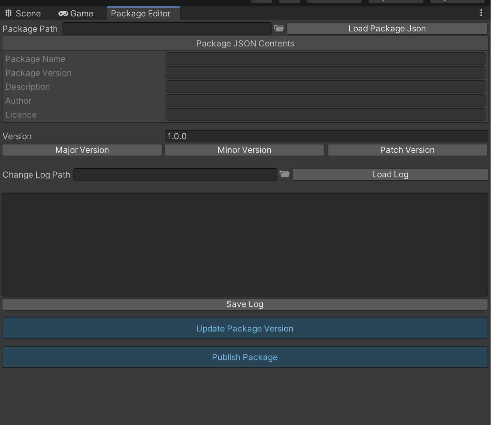

# Package Tools

## About

## Package Initializer

The Package Initializer is a editor window built using Odin Inspector, it allows for quick creation of files from within the Unity editor. The files that can be created are as follows:
* package.json
* README.md
* CHANGELOG.md
* LICENCE.md

### Package Editor

The Package Editor is a simple editor window built using Odin Inspector, it allows for the quick updating of a package.json file without having to leave the editor.

The main two functions are allowing the incrementing of the package version using major, minor or patch increments and apply this to the package.json file. Secondly is the ability to publish a package directly from the editor without having to swap tp the command line or terminal.

## Requirements

The Package Editor was built using the Odin Inspector Unity plugin as it makes creating editor windows very quick. This plugin is required for this tool to work. You can learn more about Odin Inspector [here](https://odininspector.com/).

## Licence

The licence is MIT License and you can find it in the repository.
